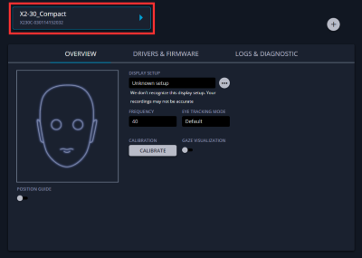
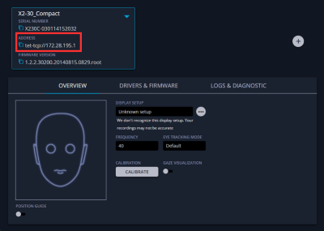

# Eye tracking

Courtesy of [`icua`](https://github.com/dicelab-rhul/icua2), `matbii` supports eye-tracking out of the box. Currently only [tobii pro eye trackers](https://www.tobii.com/) are supported. If you want to make use of another eye tracker provider, see [eye tracker API](#eye-tracker-api).

Events:

- [`EyeMotionEvent`](TODO)
- [`EyeMotionEventRaw`](TODO)

## Configuration

Eye tracking can be configured via the [main configuration file](../configuration.md).

Otherwise, make use of the [eye tracking api](#eye-tracker-api).

## Calibration

`matbii` does not currently support calibrating eye trackers out of the box, this should be done via tools provided by your eye tracker manufacturer.

=== "Tobii"
    Tobii eye trackers can be calibrated using [tobii eye tracker manager](https://connect.tobii.com/s/etm-downloads?). This is also where you will find your eyetracker URI (see [section below](#finding-your-eye-tracker-uri)).

## Finding your eye tracker URI

The URI is used by `matbii` to locate and connect to your eye tracker device. w

=== "Tobii"
    {.card width=45% align=left}
    {.card width=45% align=right}

## Eye tracking API

!!! failure "DOCUMENTATION COMING SOON"

